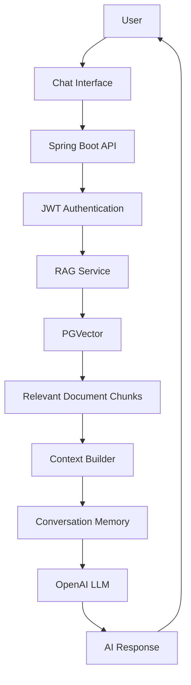
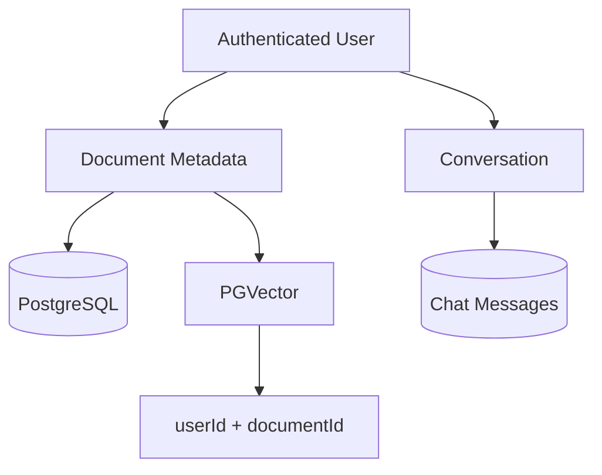
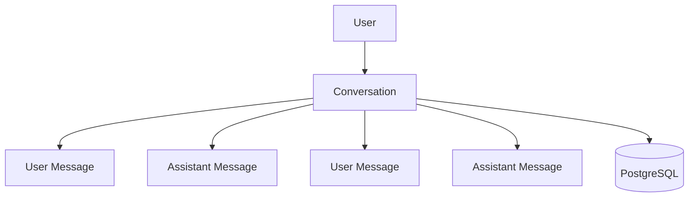
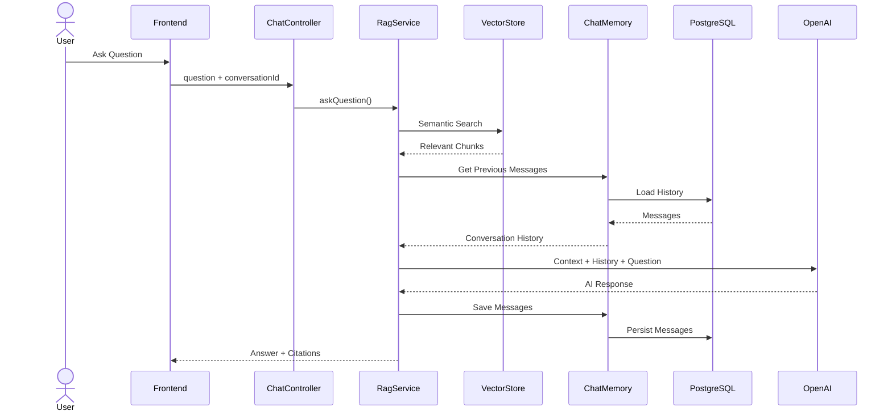
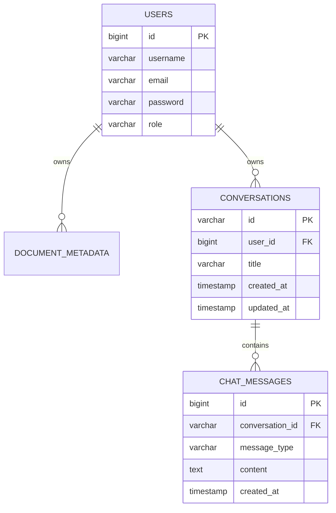
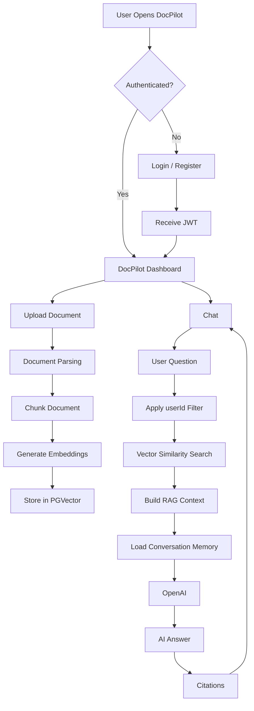

# 🚀 DocPilot

> **AI-Powered Document Intelligence & RAG Platform**

DocPilot is a full-stack **AI document intelligence platform** that allows users to upload documents, search document content, ask questions using natural language, and maintain persistent conversations with an AI assistant.

The platform combines **Spring Boot, Spring AI, PostgreSQL, PGVector, OpenAI, React, TypeScript, Tailwind CSS, and Zustand** to provide a secure, scalable, and user-isolated document question-answering experience.

---

## 📌 Table of Contents

* [Overview](#-overview)
* [Key Features](#-key-features)
* [Architecture](#-architecture)
* [Technology Stack](#-technology-stack)
* [Application Flow](#-application-flow)
* [Authentication](#-authentication)
* [Document Management](#-document-management)
* [RAG Pipeline](#-rag-pipeline)
* [User Data Isolation](#-user-data-isolation)
* [Conversation Memory](#-conversation-memory)
* [Frontend](#-frontend)
* [Backend API](#-backend-api)
* [Database Design](#-database-design)
* [Project Structure](#-project-structure)
* [Configuration](#-configuration)
* [Running the Application](#-running-the-application)
* [Security](#-security)
* [Future Enhancements](#-future-enhancements)
* [Author](#-author)

---

# 🎯 Overview

DocPilot is designed to provide an intelligent interface for interacting with user-uploaded documents.

Users can:

* Register and authenticate securely.
* Upload one or multiple documents.
* Search documents using semantic similarity.
* Ask questions about their documents.
* Chat with an AI assistant.
* Select a specific document or query across their own documents.
* View citations from retrieved document chunks.
* Maintain multiple conversations.
* Continue previous conversations.
* Store conversation history in PostgreSQL.
* Inspect document chunks and metadata.
* Use document templates and predefined workflows.

The application follows a **multi-tenant data isolation model**, ensuring that document and conversation data belongs to the authenticated user.

---

# ✨ Key Features

## 🔐 Authentication & Authorization

* User registration.
* Username/password login.
* JWT-based authentication.
* Stateless Spring Security configuration.
* Protected backend APIs.
* Protected frontend routes.
* Automatic token injection into API requests.
* Automatic logout when an authentication token expires.
* Role-based authorization.

---

## 📄 Document Management

Users can:

* Upload a single document.
* Upload multiple documents.
* View their uploaded documents.
* Select a document for chat.
* Delete documents.
* View document metadata.
* View document processing status.
* View document chunks.

Example document information:

```text
Document
 ├── File Name
 ├── Content Type
 ├── File Size
 ├── Total Pages
 ├── Total Chunks
 ├── Processing Status
 └── Created At
```

The frontend uses:

```http
GET /api/v1/documents/user
```

for the normal user document list rather than the administrator-only document endpoint.

---

# 🤖 AI Document Chat

DocPilot provides an AI-powered chat experience using document-grounded retrieval.

Users can ask questions such as:

```text
What are the termination conditions mentioned in this contract?
```

```text
Summarize the payment obligations.
```

```text
What are the penalties for late delivery?
```

The system:

1. Receives the user's question.
2. Identifies the authenticated user.
3. Retrieves relevant document chunks.
4. Applies user/document filters.
5. Builds the RAG context.
6. Retrieves conversation history.
7. Sends context + conversation history + question to the LLM.
8. Generates the answer.
9. Stores the conversation.
10. Returns citations.

---

# 🔎 Semantic Document Search

DocPilot supports semantic similarity search.

Users can search for:

* Clauses
* Concepts
* Facts
* Terms
* Relevant document sections

API:

```http
POST /api/v1/chat/search/similarity
```

Example request:

```json
{
  "query": "termination clause",
  "documentId": "document-id",
  "topK": 10,
  "similaritySearch": 0.7
}
```

Example response:

```json
{
  "query": "termination clause",
  "totalMatches": 5,
  "matches": []
}
```

---

# 🧠 RAG Architecture

DocPilot uses **Retrieval-Augmented Generation (RAG)**.



The RAG pipeline retrieves relevant chunks before sending the question to the LLM.

---

# 🔐 User Data Isolation

One of the core architectural goals of DocPilot is **multi-user data isolation**.

Every uploaded document belongs to a specific authenticated user.



Document ownership is represented through the relationship:

```text
User
  |
  | 1:N
  ↓
DocumentMetadata
```

The vector metadata also contains:

```text
userId
documentId
fileName
contentType
chunkIndex
pageNumber
```

This allows RAG searches to be restricted to the authenticated user's documents.

---

# 🛡️ User-Isolated RAG Search

For a specific document:

```text
userId = currentUserId
AND
documentId = requestedDocumentId
```

For all documents belonging to the user:

```text
userId = currentUserId
```

Conceptually:

```java
FilterExpressionBuilder builder =
        new FilterExpressionBuilder();

Filter.Expression filter =
        builder.and(
            builder.eq(
                "userId",
                currentUserId.toString()
            ),
            builder.eq(
                "documentId",
                documentId.toString()
            )
        ).build();
```

This prevents a user's RAG query from retrieving vector chunks belonging to another user.

---

# 💬 Conversation Memory

DocPilot maintains persistent conversation history using PostgreSQL.

The conversation architecture is:



The backend uses Spring AI's:

```text
MessageChatMemoryAdvisor
```

with a custom:

```text
JpaChatMemory
```

implementation.

The memory subsystem retrieves previous messages using the `conversationId`, attaches the history to the prompt, and persists new messages.

---

# 🧠 Conversation Lifecycle



The documented memory flow retrieves recent messages, combines them with RAG context and the current question, and stores the resulting messages back in PostgreSQL.

---

# 🗄️ Database Design

## Entity Relationship



---

# 📊 Conversation Tables

### `conversations`

```sql
CREATE TABLE conversations (
    id VARCHAR(100) PRIMARY KEY,
    user_id BIGINT NOT NULL REFERENCES users(id)
        ON DELETE CASCADE,
    title VARCHAR(255) NOT NULL,
    created_at TIMESTAMP NOT NULL DEFAULT NOW(),
    updated_at TIMESTAMP NOT NULL DEFAULT NOW()
);
```

### `chat_messages`

```sql
CREATE TABLE chat_messages (
    id BIGSERIAL PRIMARY KEY,
    conversation_id VARCHAR(100) NOT NULL
        REFERENCES conversations(id)
        ON DELETE CASCADE,
    message_type VARCHAR(50) NOT NULL,
    content TEXT NOT NULL,
    created_at TIMESTAMP NOT NULL DEFAULT NOW()
);
```

Indexes are used for efficient conversation and message retrieval.

---

# 🎨 Frontend

DocPilot's frontend is built using:

* React 19
* TypeScript
* Vite
* Tailwind CSS v4
* Zustand
* Axios
* React Router
* Lucide React
* React Hot Toast
* Framer Motion

The frontend follows a dark slate/indigo visual identity.

---

# 🧩 Frontend Features

## Authentication

### Login

```text
Username
Password

[ Login ]
```

### Registration

```text
Username
Email
Password
Confirm Password

[ Register ]
```

---

## 📁 Document Upload

Supports:

```text
Single Document
        +
Multiple Documents
```

with:

* Upload dialog
* File selection
* Upload progress
* Processing status
* Success/error notifications

---

# 💬 Chat Interface

The chat UI provides:

* Conversation list
* New chat
* Chat history
* User messages
* AI responses
* Markdown responses
* Citations
* Document selection
* Streaming mode
* Normal request/response mode

The frontend creates a `conversationId` using:

```javascript
crypto.randomUUID()
```

for a new conversation and reuses it for subsequent messages.

---

# ⚡ Streaming Chat

DocPilot supports two chat modes:

```text
Normal Mode
     │
     └── POST /api/v1/chat/query

Streaming Mode
     │
     └── POST /api/v1/chat/stream
```

Streaming uses a raw `fetch` request because the backend returns chunked text rather than an SSE-framed JSON response.

Authentication is manually attached to the streaming request:

```http
Authorization: Bearer <accessToken>
```

---

# 📚 Document Search

The frontend provides search functionality for:

* Clauses
* Concepts
* Facts
* Semantic matches

Search results can display:

```text
Document
Page
Chunk
Similarity Score
Snippet
```

---

# 🧩 Document Chunks

Users can inspect chunk information generated during document ingestion.

Example:

```text
Document
 ├── Chunk #1
 │    ├── Page
 │    ├── Content
 │    └── Metadata
 │
 ├── Chunk #2
 │    ├── Page
 │    ├── Content
 │    └── Metadata
 │
 └── Chunk #3
      ├── Page
      ├── Content
      └── Metadata
```

---

# 📑 Templates

DocPilot provides predefined document intelligence templates/workflows for common document analysis scenarios.

The frontend is designed to expose these templates through the Templates panel.

---

# 🔌 Backend API

Base URL:

```text
/api/v1
```

---

## Authentication APIs

### Register

```http
POST /api/v1/auth/register
```

Request:

```json
{
  "username": "john",
  "email": "john@example.com",
  "password": "password"
}
```

---

### Login

```http
POST /api/v1/auth/login
```

Request:

```json
{
  "username": "john",
  "password": "password"
}
```

Response:

```json
{
  "accessToken": "JWT_TOKEN",
  "user": {
    "id": 1,
    "username": "john",
    "email": "john@example.com",
    "role": "USER"
  }
}
```

---

# 📄 Document APIs

| Method | Endpoint                     | Purpose                      |
| ------ | ---------------------------- | ---------------------------- |
| POST   | `/documents/upload`          | Upload document              |
| POST   | `/documents/upload-multiple` | Upload multiple documents    |
| GET    | `/documents/user`            | Get current user's documents |
| GET    | `/documents/{id}`            | Get document                 |
| DELETE | `/documents/{id}`            | Delete document              |

---

# 💬 Chat APIs

| Method | Endpoint                  | Purpose                  |
| ------ | ------------------------- | ------------------------ |
| POST   | `/chat/query`             | Normal RAG query         |
| POST   | `/chat/stream`            | Streaming RAG query      |
| POST   | `/chat/search/similarity` | Semantic document search |

The frontend specification defines these API contracts and explicitly uses `/documents/user` for normal user document retrieval.

---

# 🗂️ Conversation APIs

The target backend architecture supports:

| Method | Endpoint                                   | Purpose             |
| ------ | ------------------------------------------ | ------------------- |
| GET    | `/api/v1/chat/conversations`               | List conversations  |
| GET    | `/api/v1/chat/conversations/{id}/messages` | Get messages        |
| DELETE | `/api/v1/chat/conversations/{id}`          | Delete conversation |

These APIs are part of the documented conversation-history architecture.

> **Current frontend compatibility note:** if these backend endpoints are not yet deployed, the frontend can temporarily use a user-namespaced `localStorage` conversation cache and later replace it with the real APIs.

---

# 📦 API Response Format

Most authenticated JSON APIs use:

```json
{
  "success": true,
  "message": "Operation successful",
  "data": {},
  "timestamp": "2026-09-24T10:30:00"
}
```

The frontend unwraps:

```javascript
response.data.data
```

Authentication endpoints return their respective raw response structures.

---

# 🏗️ Project Structure

```text
docpilot/
│
├── backend/
│   ├── src/
│   │   ├── main/
│   │   │   ├── java/
│   │   │   │   └── com/irusol/docpilot/
│   │   │   │
│   │   │   └── resources/
│   │   │
│   │   └── test/
│   │
│   └── pom.xml
│
├── frontend/
│   └── docpilot-frontend/
│       │
│       ├── src/
│       │   ├── components/
│       │   ├── pages/
│       │   ├── services/
│       │   ├── store/
│       │   ├── types/
│       │   ├── App.tsx
│       │   └── main.tsx
│       │
│       ├── public/
│       ├── package.json
│       ├── vite.config.ts
│       └── tsconfig.json
│
├── frontend/
│   └── screenshots/
│
└── README.md
```

---

# 🧠 State Management

DocPilot uses **Zustand** as the primary frontend state-management solution.

### Authentication Store

```text
authStore
 ├── user
 ├── token
 ├── isLoading
 ├── login()
 ├── register()
 └── logout()
```

### Document Store

```text
documentStore
 ├── documents
 ├── selectedDocument
 ├── activeTab
 ├── sidebar state
 └── document actions
```

### Conversation Store

```text
conversationStore
 ├── conversations
 ├── activeConversationId
 ├── messages
 ├── loadChats()
 ├── newChat()
 ├── selectChat()
 ├── deleteChat()
 └── appendMessage()
```

The frontend specification intentionally migrates the previous React Context state to Zustand so the application has one consistent state-management approach.

---

# 🔒 Frontend Security

All authenticated Axios requests include:

```http
Authorization: Bearer <accessToken>
```

The frontend Axios interceptor retrieves the token from the Zustand authentication store.

Protected routes redirect unauthenticated users to:

```text
/login
```

An expired or invalid token causes:

```text
logout()
     ↓
clear authentication state
     ↓
redirect to /login
```

---

# 🚦 Application Flow



---

# 🛠️ Technology Stack

## Backend

| Technology      | Purpose                        |
| --------------- | ------------------------------ |
| Java            | Backend language               |
| Spring Boot     | Application framework          |
| Spring Security | Authentication & authorization |
| JWT             | Stateless authentication       |
| Spring AI       | AI integration                 |
| OpenAI          | LLM                            |
| PostgreSQL      | Relational database            |
| PGVector        | Vector database/search         |
| Spring Data JPA | Persistence                    |
| Maven           | Build management               |

## Frontend

| Technology      | Purpose             |
| --------------- | ------------------- |
| React 19        | UI                  |
| TypeScript      | Type safety         |
| Vite            | Frontend build tool |
| Tailwind CSS v4 | Styling             |
| Zustand         | State management    |
| Axios           | HTTP client         |
| React Router    | Routing             |
| Lucide React    | Icons               |
| React Hot Toast | Notifications       |
| Framer Motion   | UI animations       |

---

# ⚙️ Configuration

Example backend configuration:

```properties
spring.datasource.url=jdbc:postgresql://localhost:5432/docpilot
spring.datasource.username=postgres
spring.datasource.password=YOUR_PASSWORD

spring.ai.openai.api-key=YOUR_OPENAI_API_KEY
```

Configure the actual values through environment variables or your preferred secure configuration mechanism.

---

# 🚀 Running the Application

## 1. Clone Repository

```bash
git clone <repository-url>
cd docpilot
```

---

## 2. Start PostgreSQL

Make sure PostgreSQL is running.

Create the DocPilot database:

```sql
CREATE DATABASE docpilot;
```

---

## 3. Start Backend

```bash
cd backend
./mvnw spring-boot:run
```

Windows:

```powershell
.\mvnw.cmd spring-boot:run
```

Backend:

```text
http://localhost:8081
```

---

## 4. Start Frontend

```bash
cd frontend/docpilot-frontend
npm install
npm run dev
```

Frontend:

```text
http://localhost:5173
```

---

# 🧪 Testing Flow

A basic end-to-end test can be performed using the following sequence.

### Step 1 — Register

```text
Register User
```

### Step 2 — Login

```text
Login
↓
JWT Token
↓
Dashboard
```

### Step 3 — Upload

```text
Upload PDF
↓
Parse
↓
Chunk
↓
Embedding
↓
PGVector
```

### Step 4 — Chat

```text
Ask Question
↓
Vector Search
↓
User Isolation
↓
RAG Context
↓
Conversation Memory
↓
OpenAI
↓
Answer + Citations
```

### Step 5 — Verify Isolation

Create:

```text
User A
User B
```

Upload documents separately.

Verify:

```text
User A → only User A documents
User B → only User B documents
```

The architecture specifically targets user-scoped documents and conversations to prevent cross-user access.

---

# 🎨 UI/UX

The application follows a modern AI-product interface with:

* Dark slate background
* Indigo/purple accents
* Sidebar navigation
* Document panel
* Chat panel
* Templates
* Search
* Document chunks
* Conversation history
* Responsive layout
* Toast notifications
* Loading states
* Streaming responses

The planned UI refinement also includes responsive sidebars, keyboard focus states, accessible icon buttons, loading skeletons, chat grouping, and subtle Framer Motion transitions.

---

# 🔮 Future Enhancements

Potential future improvements include:

* Persistent conversation REST APIs
* Document sharing
* Team workspaces
* Advanced document permissions
* Document comparison
* AI-generated document summaries
* Automatic document classification
* Advanced clause extraction
* Export conversations
* Conversation title generation
* Multi-document comparison
* Advanced citation navigation
* Streaming citations
* Admin dashboard
* Usage analytics
* AI token/cost tracking
* Docker deployment
* Kubernetes deployment
* Cloud deployment

---

# 🔐 Security Principles

DocPilot follows several security principles:

```text
JWT Authentication
       ↓
Authenticated User
       ↓
User-Owned Documents
       ↓
User-Scoped Vector Search
       ↓
User-Owned Conversations
       ↓
User-Scoped Chat Memory
```

The most important rule is:

> **Never trust a document ID or conversation ID supplied by the client without validating ownership on the server.**

Document and conversation repositories should therefore support user-scoped lookup methods such as:

```java
findByIdAndUser(...)
```

and:

```java
findByUserOrderByUpdatedAtDesc(...)
```

The documented architecture uses this ownership pattern for conversation retrieval and deletion.

---

# 📈 Architecture Benefits

### 🔒 Privacy

User documents and conversations are isolated.

### 🧠 Context-Aware AI

The assistant can use both:

```text
Document Context
+
Conversation History
```

### ⚡ Performance

Vector search and indexed conversation retrieval reduce unnecessary database work.

### 🧩 Modular Architecture

The application separates:

```text
Authentication
Documents
RAG
Vector Search
Conversation Memory
Frontend State
```

### 🔄 Persistent Memory

Conversation history survives application restarts because it is stored in PostgreSQL rather than only browser memory.

---

# 👨‍💻 Author

**Shoaib Hasan**

Software Engineer | Java | Spring Boot | Microservices | AI

---

# ⭐ Project

If you find this project useful, consider giving the repository a ⭐.

```text
DocPilot AI
AI-Powered Document Intelligence Platform
```
